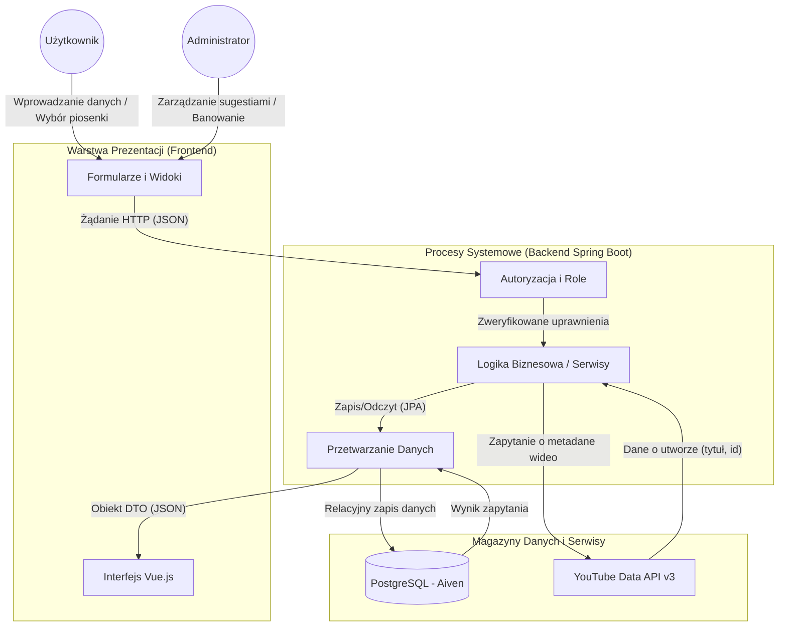

# Diagram Przepływu Danych (DFD)

Poniższy schemat przedstawia przepływ informacji w systemie Karaoke Machine – od interakcji użytkownika, przez logikę biznesową, aż po zewnętrzne API i bazę danych hostowaną na Aiven.

